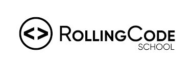

# 🚀 Rolling Code - Full Stack Developer

🎓 **Bootcamp Full Stack en Rolling Code School.**  
Formación intensiva orientada al desarrollo web completo, desde la interfaz hasta el servidor, con enfoque en buenas prácticas, trabajo en equipo y metodologías ágiles.

---

## 🧠 Módulos

### ✅ Módulo 1: **Front End**

- 🖥️ HTML
- 🎨 CSS
- ⚙️ Bootstrap

### ✅ Módulo 2: **Herramientas & Metodologías**

- 📋 Metodologías Ágiles (SCRUM)
- 🔧 Git
- 🌐 GitHub
- ✨ JavaScript

### 🔄 Módulo 3: **React JS**

- ⚛️ React

### 🔄 Módulo 4: **Back End**

- 🧩 Node.js 
- 🗄️ MongoDB 

---

## 📌 Objetivo

**Convertirme en un desarrollador full stack capaz de crear soluciones reales con tecnologías modernas, trabajando en equipo y aportando valor a cada proyecto.**

---

## 💪 En constante evolución

Este repositorio irá creciendo con cada nuevo aprendizaje, práctica o proyecto.

---

> _"La práctica hace al maestro. El código, al desarrollador."_ 👨‍💻
